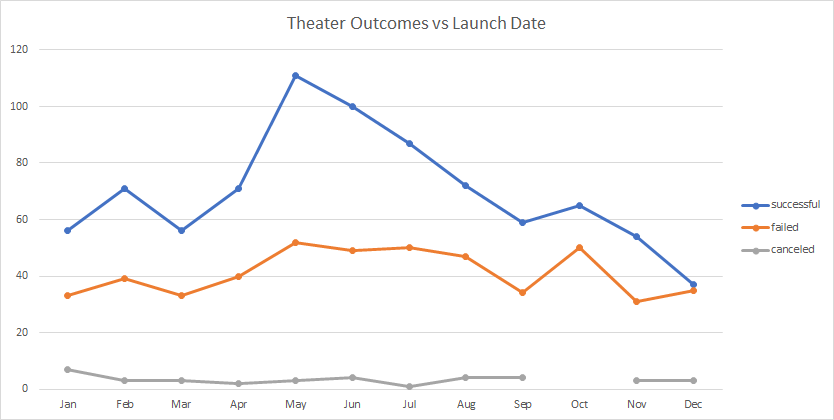
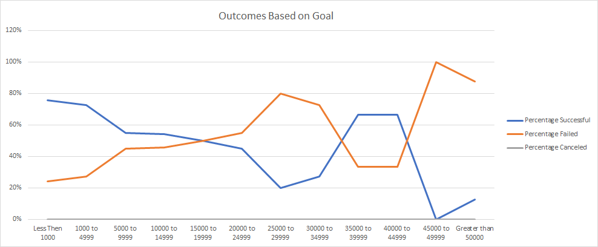

# An Analysis of Kickstarter Campaigns

## Overview of Project

### Purpose

The purpose of this project is to provide Louise with an analysis and insights into the outcomes of past Kickstarter campaigns so that she may make more informed decisions about how to maximize the probability of success for her own campaign.

## Analysis and Challenges

### Analysis of Outcomes Based on Launch Dates

An analysis was performed based on the date that each campaign belonging to the "theater" parent category was launched. The potential outcomes that were considered for this analysis were successful, failed, and canceled. These outcomes were compared to the month that the campaign was launched in to provide the following result.

### Analysis of Outcomes Based on Goals

An analysis was performed based on the initial goal amount of all the campaigns belonging to the "plays" subcategory. The potential outcomes that were considered for this analysis were successful, failed, and canceled. The amounts of the goals were subdivided into 12 bins for ease of analysis, and the percentage of the respective bucket for each outcome was calculated with the following result. 

 

### Challenges and Difficulties Encountered

A difficulty was encountered when performing the analysis of outcomes based on goals. When the number of successful campaigns was calculated for each bin, column B, a validation check of the formulas was performed. This was done by comparing the sum of the successful results in column B against the calculation of all successful plays with goals greater than 0. The results of these two figures should be the same, however in this case the sum of the successful results was one less. This discrepancy was resolved by debugging the formulas used in column B to calculate the number of successful plays. It was discovered that an "=" was missing from a single formula resulting in one result being missed. With this correction the validation check matched and the analysis could proceed.

## Results

### Recommendation

Upon review of the analysis of outcomes based on launch dates a number of conclusions can be drawn. Firstly, campaigns starting in the summer months of May, June, and July have the greatest success results with May being particularly strong. Secondly, the month of December is to be avoided as the incidents of success are nearly equal with the incidents of failure. When reviewing the analysis of outcomes based on goal amount one can conclude that the highest incidents of success are for campaigns with goals less then $5000. As a result of these conclusions it is recommended that Louise limit her campaign goal to under $5000 and launch it in the month of May for the greatest likelihood of success. 

### Limitations 

One limitation of the dataset used for this analysis is that it only includes campaigns launched up to and including 2017. This means that any recent trend developments of the last 5 years will not be captured in the analysis. Another limitation is that the data comes from a single source, Kickstarter. There are a number of other crowdfunding platforms such as Patreon, Indiegogo, and GoFundMe that can be drawn upon to develop more robust insights.

### Additional Analysis

Further analysis can be performed from the existing dataset. This could include a table looking at the average numeber of backers and average donation per backer for successful plays to determine in the anticipated number of backers and donations for Louise's campaign would be sufficient to meet her campaign goal.
